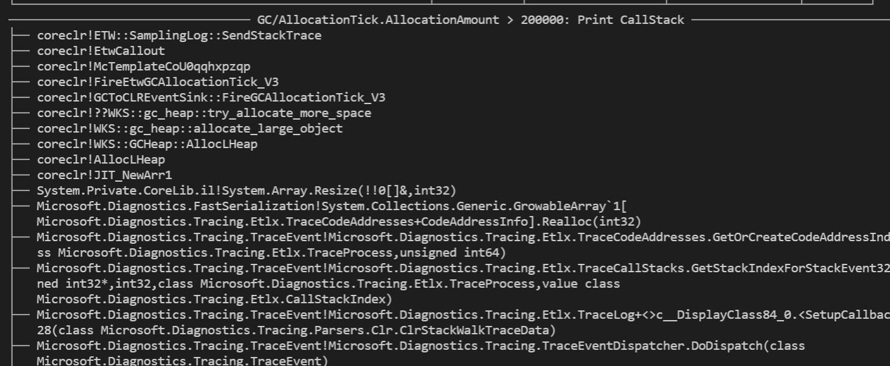
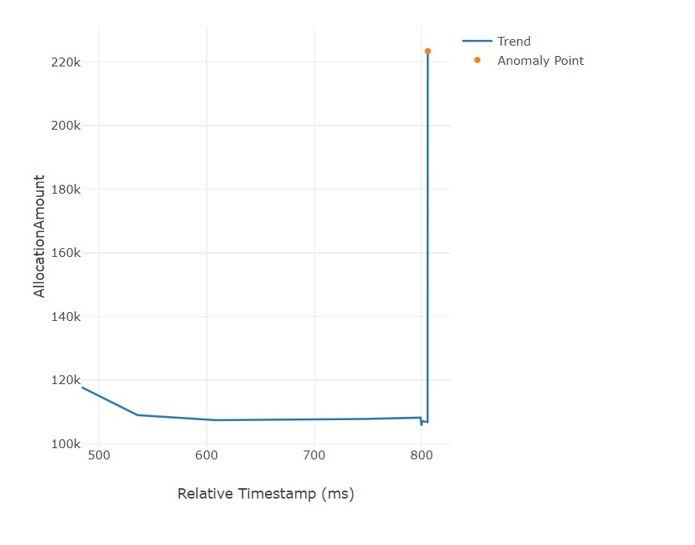

# FSharpAdvent_2021: Perf-Avore, A Rule Based Performance Analysis Tool

For my 2021 F# Advent Submission, I developed a Performance Based Analysis Tool called __Perf-Avore__ that uses Rules specified by the user to match conditions and invoke actions on either Event Tracing for Windows based Trace files or real time processes.  

At a very high level:

1. Users provide rules.
   1. Rules consist of conditions and actions.
   2. Conditions Include: 
      1. The Name of the Trace Event and the property they'd like to trace. 
      2. The condition or case for which they'd like to act on.
      3. Examples:
         1. ``GC/AllocationTick.AllocationAmount > 200000 : Print Events``
         2. ``ThreadPoolWorkerThreadAdjustment/Stats.Throughput < 4: Print Alert``
2. Based on either a given trace or by real time monitoring, conditions are checked for and actions are invoked.

## Condition Types

The following are the currently implemented Conditions worth mentioning

| Condition Operation | Description | 
| ----------- | ----------- |
| IsAnomaly | The condition to match on an anomaly detection algorithm. | 

The currently implemented algorithm is that of __IID Spike Detector__ based on the ML.NET algorithm that can be found [here](https://github.com/dotnet/machinelearning/blob/main/src/Microsoft.ML.TimeSeries/IidSpikeDetector.cs). More details about this algorithm can be found in the [Notebook](FSharpAdvent_2021.ipynb).

## Action Types

The following are the currently implemented action types.

| Name of Action Type | Description | 
| ----------- | ----------- |
| Alert | Alerting Mechanism that'll print out pertinent details about the rule invoked and why it was invoked. |
| Call Stack | If a call stack is available, it will be printed out on the console. |
| Chart | A chart of data points preceding and including the one that triggered the condition of the rule is generated and rendered as an html file | 

## Running Perf-Avore

### Command Line Options

| Name of Action Type | Description | 
| ----------- | ----------- |
| Alert | Alerting Mechanism that'll print out pertinent details about the rule invoked and why it was invoked. |
| Call Stack | If a call stack is available, it will be printed out on the console. |
| Chart | A chart of data points preceding and including the one that triggered the condition of the rule is generated and rendered as an html file | 

#### Examples of Action Invocation

1. Alert

2. Call Stack

3. Chart

## Developing Perf-Avore

This project was directly inspired by @maoni0's [realmon](https://github.com/Maoni0/realmon). 
### Prototypes

The following were some of the prototypes created while developing Perf-Avore:

1. Charting with the Trace Log API
2. Anomaly Detection using ML.NET
3. Rule Engine Domain 
4. Call Stack With Symbol Resolution

## TODO For the FSharp Advent Submission

1. ~RealTime Monitoring as a Console App~
2. ~Integrating Anomaly Detection into the Rules Engine~
3. ~Creating a Console App that'll demonstrate spikes~
   1. ~On a timer allocate a significant amount of memory~
4. Write the f*cking post

## References

1. [Taking Stock of Anomalies with F# And ML.NET](https://www.codesuji.com/2019/05/24/F-and-MLNet-Anomaly/)
2. [A CPU Sampling Profiler in Less Than 200 Lines](https://lowleveldesign.org/2020/10/13/a-cpu-sampling-profiler-in-less-than-200-lines/)
3. [Tutorial: Detect anomalies in time series with ML.NET](https://docs.microsoft.com/en-us/dotnet/machine-learning/tutorials/phone-calls-anomaly-detection)
4. [arXiv:1204.3251](https://arxiv.org/pdf/1204.3251.pdf)